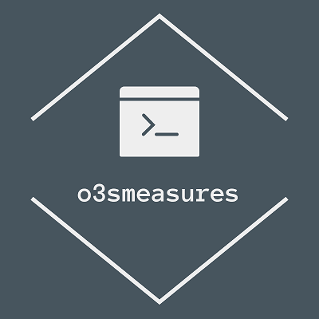

 

       

       

## o3smeasures

*Plug-in for Eclipse to measure software internal quality. It was developed as part of my dissertation entitled "A Quantitative Study to Characterize the Internal Quality of Open-Source Object-Oriented Software Systems".*

## About o3smeasures
This is a plug-in for Eclipse to measure software internal quality in Java projects.
In the plug-in development, we used the Eclipse IDE (Oxygen), the Java Development Tools (JDT), the Plug-in Development Environment (PDE), and Abstract Syntax Tree (AST). In JDT, there are tools for manipulating Java code. In PDE, there are tools to develop and test plug-ins in the Eclipse IDE.

## Dependencies

- Java 8 or higher
- Eclipse IDE Oxygen or higher
- jUnit 5 (org.junit.jupiter.api, org.junit.jupiter.engine and org.junit.jupiter.params - 5.0.0)
- org.eclipse.ui (3.109.0 or higher)
- org.eclipse.core.resources (3.12.0 or higher)
- org.eclipse.jdt.core (3.13.102 or higher)
- org.eclipse.core.runtime (3.13.0 or higher)
- org.eclipse.jface.text (3.12.2 or higher)

## How to use as an Eclipse Application

o3smeasures can be used as an Eclipse Application, importing the project into your workspace.
After import the o3smeasures project, with the right mouse button you need select the option 
<b>Run as</b> -> <b>Eclipse Application</b>. In the runtime eclipse application, select a Java project to be measured and with the right mouse button, go to <b>O3SMeasures</b> -> <b>Analyze Java project</b>.

## Executing tests

After import the o3smeasures project, with the right mouse button you need select the option 
<b>Run as</b> -> <b>JUnit Plug-in Test</b>.

## How to install

### On dropins directory 

o3smeasures plug-in is installed in the Eclipse directory. You need to paste the .jar on the <b>dropins</b> directory (<b>eclipse</b> -> <b>dropins</b>).
After installed the o3smeasures project into your workspace, select a Java project to be measured and with the right mouse button, go to <b>O3SMeasures</b> -> <b>Analyze Java project</b>.

### Install new Software interface

Run Eclipse, go to <b>Help menu</b> -> <b>Install New Software...</b> On the opening dialog add a new Remote site named o3smeasures with the following url `https://raw.githubusercontent.com/mariazevedo88/o3smeasures-plugin/master/site.xml` and follow the instructions.

### On Eclipse Marketplace

Run Eclipse, go to <b>Help menu</b> -> <b>Eclipse Marketplace...</b> On the opening dialog, search for `o3smeasures`. Finding the plugin, click on the <b>Install</b> button and follow the instructions.

## Displaying the views

The o3smeasures views can be enabled by the eclipse menu <b>Window</b> -> <b>Show View</b> -> <b>Other ...</b> -> <b>o3smeasures</b>.
 
## Exporting files

To export the measurement results in the <b>O3SMeasures Diagnostic view</b>, with the right mouse button in the view, select the option <b>Export to CSV file</b> to export in the `.csv` format or <b>Export to XML file</b> to export in the `.xml` format.

## Uploading files

In version 2.1.0 or above, it is possible to upload measurement diagnostic reports to an s3 bucket on Amazon (AWS). You need to select the option <b>Upload to AWS S3 Bucket</b> to export in the `.csv` or `.xml` format. The formating options and the bucket configurations has to be defined on the Preferences Page.

## Contributing

